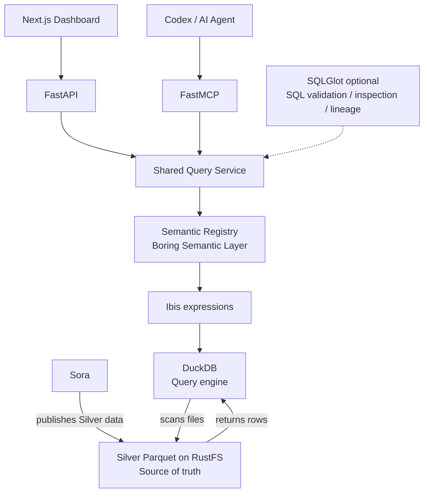
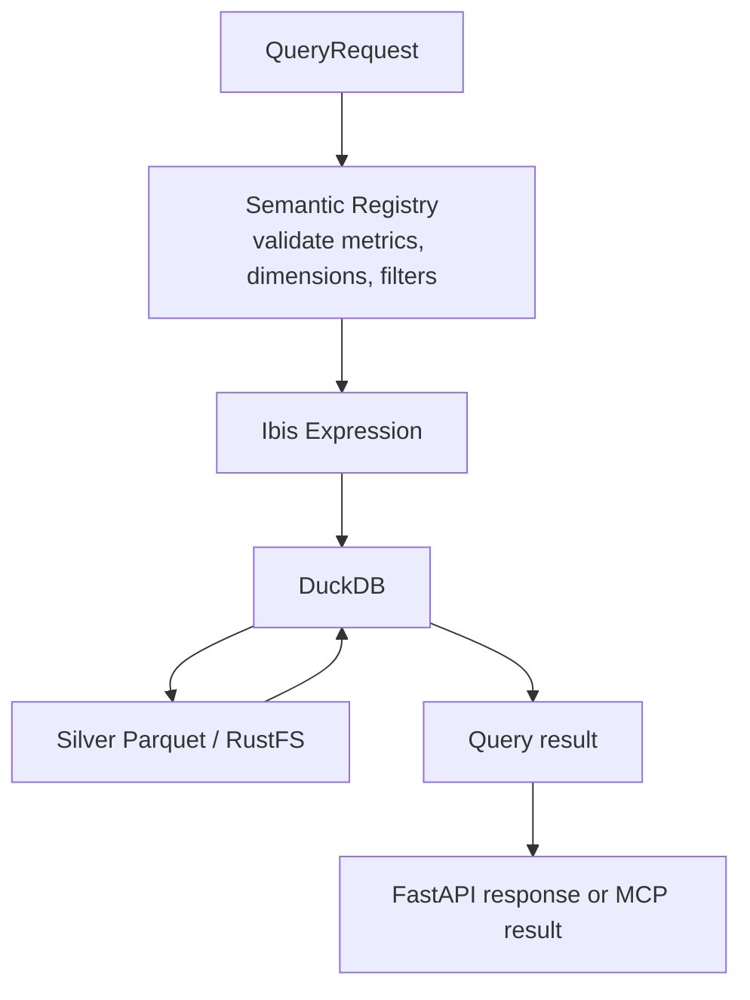
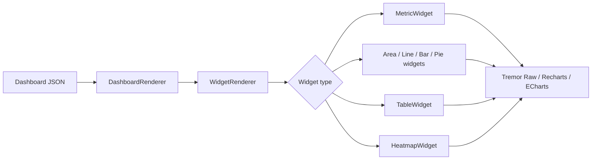

# Sora-SemanticLayer

## 1. Mục tiêu

Xây dựng analytics layer độc lập trên dữ liệu Silver từ Sora. Hệ thống cung cấp semantic metrics/dimensions dùng chung qua API, MCP cho Codex/AI Agent và Dynamic Dashboard render từ JSON. Authentication/Authorization chưa nằm trong phạm vi hiện tại. Không thực hiện ETL và không thay đổi dự án Sora.

## 2. Architecture

### Repository layout

```text
backend/                 Python project: FastAPI, FastMCP, semantic layer, Silver reader
  src/sora_semantic/      Importable backend package
  api.py, mcp.py           Local API/MCP launchers (`uv run api.py`, `uv run mcp.py`)
  .envrc                   Shared env + backend-local env
  tests/                  Backend tests
  dashboard/config/       Dashboard JSON definitions served by the API
dashboard/                Independent TypeScript/Next.js application
.envrc                    Root shared environment loader
.env.shared.example       Safe shared variable template
docs/                     Architecture, data contract, and API documentation
```

FastAPI and FastMCP remain interfaces of one backend project and share the semantic query service. The Dashboard is a separate application that consumes the API. Dashboard JSON definitions remain under `backend/dashboard/config/` because the backend currently serves them through `/api/v1/dashboards`. `direnv` loads `.env.shared` at repo root and combines it with each app's `.env.local`; secrets remain app-local.



Nguồn dữ liệu được đọc trực tiếp từ Silver Parquet trong RustFS. DuckDB thực thi truy vấn; nó không phải nơi lưu trữ dữ liệu chuẩn. `SQLGlot` là tùy chọn, chỉ thêm khi cần kiểm tra SQL hoặc lineage.

## 3. Tech Stack

### Python Core

- Python 3.14, `uv`
- DuckDB, Ibis Framework, Boring Semantic Layer
- FastAPI, FastMCP, Pydantic
- SQLGlot (optional)

Boring Semantic Layer (BSL) là semantic layer Python nhẹ xây trên Ibis; Ibis có DuckDB backend chính thức.

### Dashboard

- Next.js, TypeScript, React, Tailwind CSS
- Tremor Raw, Recharts, ECharts cho visualization phức tạp
- TanStack Query, TanStack Table

Tremor Raw được dùng theo hướng copy component vào source để toàn quyền chỉnh sửa.

## 4. Source Data

Chỉ đọc Silver Parquet từ RustFS. Sora hiện xuất các dataset sau, gồm source-level facts, dimensions và report outputs:

```text
dim_app
dim_country
dim_date

ga4_daily_overview
ga4_retention_cohort
admob_mediation_daily
google_ads_campaign_geo_daily
fx_daily

report/app_daily
report/campaign_geo
report/retention
```

Schema đầy đủ, S3 paths, partitioning, grains và lineage được ghi trong [Silver Data Catalog](SILVER_DATA_CATALOG.md). Cách Sora build/publish Silver và contract consumer được mô tả trong [Silver Source Design](SILVER_SOURCE_DESIGN.md). RustFS/Parquet là source of truth; DuckDB chỉ là query engine. Catalog tách object production khỏi `staging/` và ghi ngày kiểm kê để không nhầm snapshot hiện tại với retention guarantee.

## 5. Semantic Layer

Semantic definitions được viết bằng Python. Danh sách dưới đây là target semantic contract; chỉ kích hoạt metric/dimension khi cột nguồn và ý nghĩa đã được xác nhận trong [Silver Data Catalog](SILVER_DATA_CATALOG.md).

### Dimensions

```text
date
app
country
app_version
campaign
ad_source
ad_unit
currency
```

### Metrics

```text
users
new_users
sessions

admob_revenue_native
ga4_total_revenue_reference
google_ads_cost_native

revenue_usd
revenue_vnd
cost_usd
cost_vnd
profit_usd
profit_vnd
roas_usd
roas_vnd

impressions
clicks
installs_by_source

cpi_google_ads_usd
cpi_google_ads_vnd
ctr
ecpm

retention_d1
retention_d7
retention_d30
```

Derived metrics được tính trong semantic layer, không lưu vào Silver:

```text
profit_usd = revenue_usd - cost_usd
profit_vnd = revenue_vnd - cost_vnd
roas_usd = revenue_usd / cost_usd
roas_vnd = revenue_vnd / cost_vnd
cpi_google_ads_usd = google_ads_cost_usd / google_ads_installs
cpi_google_ads_vnd = google_ads_cost_vnd / google_ads_installs
```

Canonical revenue chỉ lấy AdMob `estimated_earnings` và Google Play subscription/IAP net proceeds khi Silver có nguồn đã xác nhận. Hiện tại chỉ AdMob có mặt trong Silver. GA4 `total_revenue` và `purchase_revenue` là reference, không đóng góp vào revenue/profit/ROAS. Không cộng đồng thời AdMob nguồn và bản sao `report/app_daily.revenue`.

Canonical cost hiện lấy Google Ads; TikTok và nguồn khác chỉ được thêm sau khi Silver có schema đã xác nhận. `finance_daily` chuẩn hóa các khoản tiền sang cả USD và VND bằng FX VND-to-USD. Khi thiếu rate cùng ngày, dùng rate gần nhất trước đó và trả `fx_rate_date` cùng `fx_fallback_used`; không có rate trước đó thì amount quy đổi là null. Không có cutoff tuổi rate. Hiện FX chỉ hỗ trợ VND/USD; currency khác giữ native và không vào USD/VND totals.

`profit` và `roas` chỉ tính khi amount revenue/cost cùng reporting currency và conversion đầy đủ; ROAS chỉ có giá trị khi cost dương. Metrics hỗ trợ grain ngày qua `business_date`; period ROAS được tính từ tổng revenue/tổng cost, không lấy trung bình ROAS ngày. CPI hiện chưa khả dụng: Google Ads CPI cần install-specific conversions; generic conversions không được coi là installs. `app_version`, `ad_source` và `ad_unit` cũng chưa có trong Silver.

Sora đã xuất `report/app_daily.roas` như một native-currency report field; nó chỉ được tính khi hai currency code bằng nhau. SemanticLayer giữ field đó thành `reported_roas_native` reference; normalized ROAS được tính riêng và không ghi ngược vào Silver.

## 6. Query Contract

Dashboard và MCP dùng chung Query Service. Request biểu diễn metrics, dimensions, filters và date range. Với measure tiền tệ, kết quả phải giữ được currency nguồn; chỉ tổng hợp hoặc so sánh nhiều nguồn sau khi currency khớp. Quy tắc currency và giới hạn schema hiện tại nằm trong catalog. Ví dụ contract:

```json
{
  "model": "finance_daily",
  "metrics": ["revenue_usd", "cost_usd", "profit_usd", "roas_usd"],
  "dimensions": ["business_date", "app_id", "country_code"],
  "filters": {
    "app_id": ["blur_face"],
    "country_code": "US"
  },
  "date_range": {
    "from": "2026-09-01",
    "to": "2026-10-01"
  }
}
```

`model` chọn đúng một semantic definition; query không tự join nhiều model. Filter chỉ nhận dimension với giá trị scalar (equality) hoặc list (IN). `date_range` là tùy chọn, inclusive ở hai đầu và áp vào time dimension của model dù dimension đó không được trả trong kết quả. Service trả `model`, metadata dimensions/metrics cùng `rows` dạng list-of-dicts. Model, field, filter hoặc date range không hợp lệ trả contract error trước khi thực thi.

Luồng xử lý query:



## 7. Authentication and Authorization

Chưa được triển khai và chưa nằm trong phạm vi dự án hiện tại. API và MCP hiện không áp dụng principal, role, permission hoặc app scope; giới hạn truy cập qua môi trường/network boundary.

## 8. FastAPI

Endpoints ban đầu:

```text
GET  /api/v1/apps

GET  /api/v1/metrics
GET  /api/v1/dimensions

POST /api/v1/query

GET  /api/v1/dashboards
GET  /api/v1/dashboards/{id}
```

Không tạo endpoint riêng cho từng metric. API dùng chung Query Service với MCP.

## 9. FastMCP

Tools trong SOF-70:

```text
list_apps
list_metrics
query_metrics
```

Không expose raw SQL. Các tool truy vấn dùng chung Query Service.

## 10. Dynamic Dashboard

Dashboard không hard-code toàn bộ layout trong React. Mỗi dashboard được mô tả bằng JSON, gồm metadata, filters, layout và widgets. Ví dụ:

```json
{
  "id": "app-overview",
  "title": "App Overview",
  "filters": [
    { "type": "app", "field": "app" },
    { "type": "date_range", "field": "date" },
    { "type": "select", "field": "country" }
  ],
  "layout": {
    "columns": 12
  },
  "widgets": [
    {
      "id": "revenue-usd",
      "type": "metric",
      "title": "Revenue (USD)",
      "metric": "revenue_usd",
      "span": 3
    },
    {
      "id": "cost-usd",
      "type": "metric",
      "title": "Cost (USD)",
      "metric": "cost_usd",
      "span": 3
    },
    {
      "id": "roas-usd",
      "type": "metric",
      "title": "ROAS (USD)",
      "metric": "roas_usd",
      "span": 3
    },
    {
      "id": "revenue-vnd",
      "type": "metric",
      "title": "Revenue (VND)",
      "metric": "revenue_vnd",
      "span": 3
    },
    {
      "id": "cost-vnd",
      "type": "metric",
      "title": "Cost (VND)",
      "metric": "cost_vnd",
      "span": 3
    },
    {
      "id": "profit-usd",
      "type": "metric",
      "title": "Profit (USD)",
      "metric": "profit_usd",
      "span": 3
    },
    {
      "id": "profit-vnd",
      "type": "metric",
      "title": "Profit (VND)",
      "metric": "profit_vnd",
      "span": 3
    },
    {
      "id": "roas-vnd",
      "type": "metric",
      "title": "ROAS (VND)",
      "metric": "roas_vnd",
      "span": 3
    },
    {
      "id": "revenue-trend",
      "type": "area_chart",
      "title": "Revenue vs Spend",
      "metrics": ["revenue_usd", "cost_usd"],
      "dimension": "date",
      "span": 8
    },
    {
      "id": "country",
      "type": "bar_chart",
      "title": "Revenue by Country",
      "metric": "revenue_usd",
      "dimension": "country",
      "span": 4
    }
  ]
}
```

## 11. React Dynamic Renderer

Frontend có component registry cho các loại widget:

```text
metric
area_chart
line_chart
bar_chart
pie_chart
table
heatmap
```

Ví dụ registry:

```tsx
const widgetRegistry = {
  metric: MetricWidget,
  area_chart: AreaChartWidget,
  line_chart: LineChartWidget,
  bar_chart: BarChartWidget,
  pie_chart: PieChartWidget,
  table: TableWidget,
  heatmap: HeatmapWidget,
}
```

Luồng render:



Dashboard mới chỉ cần JSON config; không cần viết React page mới.

## 12. Dashboard Config Storage

MVP lưu cấu hình backend phục vụ trong `backend/dashboard/config/*.json`:

```text
backend/dashboard/config/
├── app-overview.json
├── monetization.json
├── acquisition.json
└── retention.json
```

Sau này có thể chuyển sang database nếu cần dashboard editor.

## 13. Initial Dashboards

### App Overview

```text
Revenue USD / Revenue VND
Cost USD / Cost VND
Profit USD / Profit VND
ROAS USD / ROAS VND
Users

Daily Revenue vs Cost (USD or VND)
Revenue by Country (selected reporting currency)
```

### Monetization

```text
Ad Revenue
eCPM
Impressions

Country
```

`ad_source` and `ad_unit` remain unavailable until Silver publishes those fields.

### Acquisition

```text
Spend
Installs by source (after verified source fields)
CPI (Google Ads install conversions only; pending Silver support)
Campaign
Country
```

### Retention

```text
D1
D7
D30

Retention Trend
Cohort Heatmap
```

## 14. Project Structure

Đây là cấu trúc repo hiện tại và ranh giới ứng dụng:

```text
Sora-SemanticLayer/
├── backend/
│   ├── pyproject.toml
│   ├── uv.lock
│   ├── scripts/
│   ├── src/sora_semantic/
│   │   ├── api.py
│   │   ├── mcp.py
│   │   ├── data/
│   │   └── semantic/
│   ├── dashboard/config/
│   └── tests/
├── dashboard/                 # Next.js/TypeScript application
├── docs/
├── .envrc
├── .env.shared.example
└── README.md
```

## 15. MVP

Xây dựng vertical slice:

```text
ga4_daily_overview
       ↓
Boring Semantic Layer + Ibis
       ↓
FastAPI query
       ↓
Dashboard JSON
       ↓
React Dynamic Renderer
```

MVP widgets:

```text
Metric
Area Chart
Bar Chart
Table
```

MVP metrics:

```text
active_users
new_users
sessions
admob_revenue_native
ga4_total_revenue_reference
google_ads_cost_native
revenue_usd / revenue_vnd
cost_usd / cost_vnd
profit_usd / profit_vnd
roas_usd / roas_vnd
```

`ga4_total_revenue_reference` chỉ phục vụ đối chiếu, không cộng vào revenue. Google Play net subscription/IAP revenue, TikTok cost và installs/CPI chưa được expose cho đến khi có dataset Silver và semantics được xác nhận.

MVP MCP tools:

```text
list_apps
list_metrics
query_metrics
```

## 16. Không làm ở MVP

```text
ETL
Gold Layer
Dashboard drag/drop editor
Custom SQL editor
Complex SQL lineage
Spark
Kafka
Cube
Malloy
```

SQLGlot chỉ thêm khi cần raw SQL guard hoặc lineage.

## 17. Success Criteria

MVP đạt khi luồng sau chạy end-to-end:

```text
Silver Parquet
→ DuckDB
→ Ibis
→ Boring Semantic Layer
→ FastAPI
→ Dynamic JSON Dashboard
```

Một dashboard mới có thể được tạo chỉ bằng một JSON file, không cần tạo React page hoặc viết query SQL mới.
