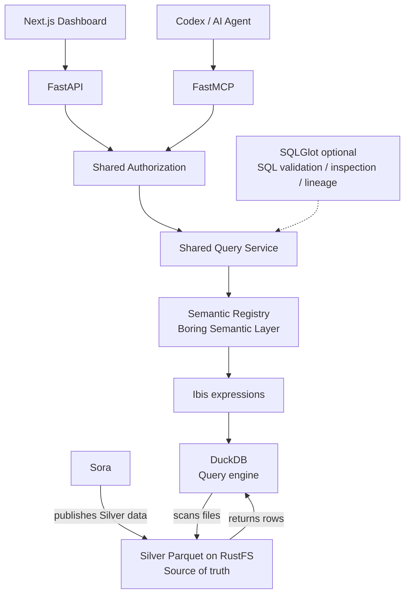
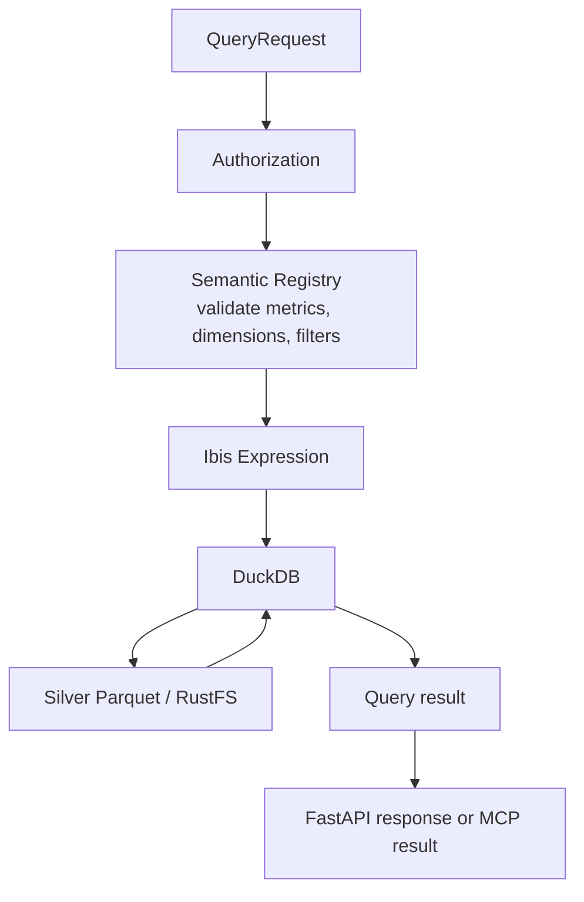
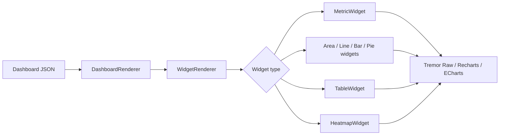

# Sora-SemanticLayer

## 1. Mục tiêu

Xây dựng analytics layer độc lập trên dữ liệu Silver từ Sora. Hệ thống cung cấp semantic metrics/dimensions dùng chung, API có Authorization cho Dashboard, MCP cho Codex/AI Agent và Dynamic Dashboard render từ JSON. Không thực hiện ETL và không thay đổi dự án Sora.

## 2. Architecture



Nguồn dữ liệu được đọc trực tiếp từ Silver Parquet trong RustFS. DuckDB thực thi truy vấn; nó không phải nơi lưu trữ dữ liệu chuẩn. `SQLGlot` là tùy chọn, chỉ thêm khi cần kiểm tra SQL hoặc lineage.

## 3. Tech Stack

### Python Core

- Python 3.13, `uv`
- DuckDB, Ibis Framework, Boring Semantic Layer
- FastAPI, FastMCP, Pydantic
- SQLGlot (optional)

Boring Semantic Layer (BSL) là semantic layer Python nhẹ xây trên Ibis; Ibis có DuckDB backend chính thức.

### Dashboard

- Next.js, TypeScript, React, Tailwind CSS
- Tremor Raw, Recharts, ECharts cho visualization phức tạp
- TanStack Query, TanStack Table

Tremor Raw được dùng theo hướng copy component vào source để toàn quyền chỉnh sửa.

## 4. Source Data

Chỉ đọc Silver Parquet từ RustFS. Sora hiện xuất các dataset sau, gồm source-level facts, dimensions và report outputs:

```text
dim_app
dim_country
dim_date

ga4_daily_overview
ga4_retention_cohort
admob_mediation_daily
google_ads_campaign_geo_daily
fx_daily

report/app_daily
report/campaign_geo
report/retention
```

Schema đầy đủ, S3 paths, partitioning, grains và lineage được ghi trong [Silver Data Catalog](SILVER_DATA_CATALOG.md). Cách Sora build/publish Silver và contract consumer được mô tả trong [Silver Source Design](SILVER_SOURCE_DESIGN.md). RustFS/Parquet là source of truth; DuckDB chỉ là query engine. Catalog tách object production khỏi `staging/` và ghi ngày kiểm kê để không nhầm snapshot hiện tại với retention guarantee.

## 5. Semantic Layer

Semantic definitions được viết bằng Python. Danh sách dưới đây là target semantic contract; chỉ kích hoạt metric/dimension khi cột nguồn và ý nghĩa đã được xác nhận trong [Silver Data Catalog](SILVER_DATA_CATALOG.md).

### Dimensions

```text
date
app
country
app_version
campaign
ad_source
ad_unit
currency
```

### Metrics

```text
users
new_users
sessions

revenue
ad_revenue
purchase_revenue

ad_spend
profit
roas

impressions
clicks
installs

cpi
ctr
ecpm

retention_d1
retention_d7
retention_d30
```

Derived metrics được tính trong semantic layer, không lưu vào Silver:

```text
profit = revenue - ad_spend
roas = revenue / ad_spend
cpi = ad_spend / installs
```

Đây là công thức mục tiêu, không có nghĩa mọi đầu vào hiện đã tồn tại hoặc có thể gộp an toàn. Silver hiện không có `installs`, `app_version`, `ad_source` hoặc `ad_unit`; do đó chưa hỗ trợ tương ứng `cpi` và các dimension đó. GA4 `total_revenue` không có currency field, trong khi AdMob earnings và Google Ads cost có currency riêng. Không gộp chúng thành `revenue`/`profit` chung hoặc tính ROAS xuyên currency nếu chưa có quy tắc nghiệp vụ và conversion policy. `fx_daily` hiện chưa được Sora dùng để quy đổi `report/app_daily`.

Sora đã xuất `report/app_daily.roas` như một report field; nó chỉ được tính khi hai currency code bằng nhau. Semantic layer không ghi derived metrics mới ngược vào Silver và phải phân biệt report có sẵn này với metric được tính động.

## 6. Query Contract

Dashboard và MCP dùng chung Query Service. Request biểu diễn metrics, dimensions, filters và date range. Với measure tiền tệ, kết quả phải giữ được currency nguồn; chỉ tổng hợp hoặc so sánh nhiều nguồn sau khi currency khớp. Quy tắc currency và giới hạn schema hiện tại nằm trong catalog. Ví dụ contract:

```json
{
  "metrics": [
    "revenue",
    "ad_spend",
    "roas"
  ],
  "dimensions": [
    "date"
  ],
  "filters": {
    "app": ["blur_face"],
    "country": ["US"]
  },
  "date_range": {
    "from": "2026-09-01",
    "to": "2026-10-01"
  }
}
```

Luồng xử lý query:



## 7. Authorization

Authorization nằm trong Python Core. Context hỗ trợ:

```text
principal
role
permissions
allowed_app_ids
```

Initial roles:

```text
admin
viewer
agent
```

Ví dụ quyền viewer:

```yaml
viewer:
  apps:
    - blur_face
  permissions:
    - metrics.read
    - dashboard.read
```

Mọi request qua API và MCP phải đi qua cùng Authorization service để cùng áp dụng quyền và giới hạn app.

## 8. FastAPI

Endpoints ban đầu:

```text
GET  /api/v1/apps

GET  /api/v1/metrics
GET  /api/v1/dimensions

POST /api/v1/query

GET  /api/v1/dashboards
GET  /api/v1/dashboards/{id}
```

Không tạo endpoint riêng cho từng metric. API dùng chung Query Service với MCP.

## 9. FastMCP

Initial tools:

```text
list_apps

list_metrics

describe_metric

query_metrics

get_app_overview

get_retention

get_campaign_performance

compare_periods
```

Không expose raw SQL làm interface chính. Mọi tool truy vấn dữ liệu dùng chung Authorization và Query Service.

## 10. Dynamic Dashboard

Dashboard không hard-code toàn bộ layout trong React. Mỗi dashboard được mô tả bằng JSON, gồm metadata, filters, layout và widgets. Ví dụ:

```json
{
  "id": "app-overview",
  "title": "App Overview",
  "filters": [
    { "type": "app", "field": "app" },
    { "type": "date_range", "field": "date" },
    { "type": "select", "field": "country" }
  ],
  "layout": {
    "columns": 12
  },
  "widgets": [
    {
      "id": "revenue",
      "type": "metric",
      "title": "Revenue",
      "metric": "revenue",
      "span": 3
    },
    {
      "id": "spend",
      "type": "metric",
      "title": "Ad Spend",
      "metric": "ad_spend",
      "span": 3
    },
    {
      "id": "roas",
      "type": "metric",
      "title": "ROAS",
      "metric": "roas",
      "span": 3
    },
    {
      "id": "revenue-trend",
      "type": "area_chart",
      "title": "Revenue vs Spend",
      "metrics": ["revenue", "ad_spend"],
      "dimension": "date",
      "span": 8
    },
    {
      "id": "country",
      "type": "bar_chart",
      "title": "Revenue by Country",
      "metric": "revenue",
      "dimension": "country",
      "span": 4
    }
  ]
}
```

## 11. React Dynamic Renderer

Frontend có component registry cho các loại widget:

```text
metric
area_chart
line_chart
bar_chart
pie_chart
table
heatmap
```

Ví dụ registry:

```tsx
const widgetRegistry = {
  metric: MetricWidget,
  area_chart: AreaChartWidget,
  line_chart: LineChartWidget,
  bar_chart: BarChartWidget,
  pie_chart: PieChartWidget,
  table: TableWidget,
  heatmap: HeatmapWidget,
}
```

Luồng render:



Dashboard mới chỉ cần JSON config; không cần viết React page mới.

## 12. Dashboard Config Storage

MVP lưu cấu hình trong `dashboard/config/*.json`:

```text
dashboard/config/
├── app-overview.json
├── monetization.json
├── acquisition.json
└── retention.json
```

Sau này có thể chuyển sang database nếu cần dashboard editor.

## 13. Initial Dashboards

### App Overview

```text
Revenue
Spend
Profit
ROAS
Users

Revenue vs Spend
Revenue by Country
```

### Monetization

```text
Ad Revenue
eCPM
Impressions

Ad Source
Ad Unit
Country
```

### Acquisition

```text
Spend
Installs
CPI
Campaign
Country
```

### Retention

```text
D1
D7
D30

Retention Trend
Cohort Heatmap
```

## 14. Project Structure

Đây là cấu trúc mục tiêu của repo:

```text
Sora-SemanticLayer/
│
├── pyproject.toml
├── uv.lock
│
├── src/
│   └── sora_semantic/
│       ├── config/
│       │
│       ├── data/
│       │   ├── duckdb.py
│       │   ├── ibis.py
│       │   └── rustfs.py
│       │
│       ├── semantic/
│       │   ├── registry.py
│       │   ├── dimensions.py
│       │   ├── metrics.py
│       │   └── models/
│       │
│       ├── query/
│       │   ├── service.py
│       │   └── models.py
│       │
│       ├── auth/
│       │
│       ├── api/
│       │
│       └── mcp/
│
├── dashboard/
│   ├── config/
│   │   ├── app-overview.json
│   │   ├── monetization.json
│   │   └── retention.json
│   │
│   └── src/
│       ├── components/
│       │   └── dashboard/
│       │       ├── DashboardRenderer.tsx
│       │       ├── WidgetRenderer.tsx
│       │       └── widgets/
│       │
│       ├── app/
│       └── lib/
│
└── tests/
```

## 15. MVP

Xây dựng vertical slice:

```text
ga4_daily_overview
       ↓
Boring Semantic Layer + Ibis
       ↓
FastAPI query
       ↓
Dashboard JSON
       ↓
React Dynamic Renderer
```

MVP widgets:

```text
Metric
Area Chart
Bar Chart
Table
```

MVP metrics theo contract ban đầu:

```text
users
revenue
ad_revenue
```

Trước khi expose, gắn `users` với GA4 active users và `ad_revenue` với AdMob `estimated_earnings` kèm currency. `revenue` chung cần được chốt định nghĩa; GA4 `total_revenue` và Sora `report/app_daily.revenue` (AdMob revenue) là hai measure khác nhau. Metric thiếu nguồn như `installs`/`cpi` không được giả lập từ cột khác.

MVP MCP tools:

```text
list_apps
list_metrics
query_metrics
```

## 16. Không làm ở MVP

```text
ETL
Gold Layer
Dashboard drag/drop editor
Custom SQL editor
Complex SQL lineage
Spark
Kafka
Cube
Malloy
```

SQLGlot chỉ thêm khi cần raw SQL guard hoặc lineage.

## 17. Success Criteria

MVP đạt khi luồng sau chạy end-to-end:

```text
Silver Parquet
→ DuckDB
→ Ibis
→ Boring Semantic Layer
→ FastAPI
→ Dynamic JSON Dashboard
```

Một dashboard mới có thể được tạo chỉ bằng một JSON file, không cần tạo React page hoặc viết query SQL mới.
