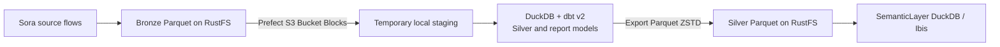

# Silver Source Design

## Mục đích và ranh giới

Tài liệu này mô tả Silver của Sora như một upstream data contract để SemanticLayer tiêu thụ. Sora sở hữu pipeline Bronze → Silver; SemanticLayer chỉ đọc Silver Parquet từ RustFS, không trigger build, không chạy ingestion và không sửa repo Sora. Danh mục cột/type/grain quan sát trực tiếp được duy trì tại [Silver Data Catalog](SILVER_DATA_CATALOG.md).

## Luồng tạo dữ liệu



Sora đăng ký Bronze files làm dbt sources, materialize models trong DuckDB rồi export từng model lên Silver S3. Local DuckDB database, dbt profile và staging files nằm trong temporary directory và bị xóa khi build kết thúc. Silver Parquet là source of truth; query engine của SemanticLayer không sở hữu hoặc cập nhật các object này.

## Runtime và cấu hình kết nối

Sora build dùng `Sora Runtime Config` cùng Prefect S3 Bucket Blocks để chọn Bronze/Silver bucket và lấy endpoint/credentials. Giá trị `APP_CONFIG__S3__SILVER__BUCKET` trong `.env` là provisioning input cho `sora seed sync`; runtime build không đọc bucket credentials từ environment. SemanticLayer được cấp quyền đọc Silver riêng; không đưa credentials vào tài liệu, dashboard config, hoặc response/query logs.

Lệnh upstream tham khảo do repo Sora sở hữu:

```bash
uv run sora silver build --date YYYY-MM-DD
```

Tài liệu này ghi nhận lệnh để mô tả interface upstream; không phải chỉ dẫn chạy lệnh từ SemanticLayer.

## Model, grain và layout

Sora Silver gồm ba dimension (`dim_app`, `dim_country`, `dim_date`), source facts cho GA4, AdMob, Google Ads và FX, cùng report projections `app_daily`, `retention`, `campaign_geo`. Danh sách S3 path, schema DuckDB, grain và đầy đủ columns/types nằm trong catalog.

Date models được publish theo `date=YYYY-MM-DD/data.parquet`. Không partition theo app, country, campaign, platform hoặc report type. `dim_app` và `dim_country` là snapshot không partition ngày; `dim_date` có date partition. Fact files giữ `business_date` hoặc `cohort_date` vật lý trong Parquet để filter độc lập với path partition.

```text
dimensions/
├── dim_app/data.parquet
├── dim_country/data.parquet
└── dim_date/date=YYYY-MM-DD/data.parquet
ga4/
├── ga4_daily_overview/date=YYYY-MM-DD/data.parquet
└── ga4_retention_cohort/date=YYYY-MM-DD/data.parquet
admob/admob_mediation_daily/date=YYYY-MM-DD/data.parquet
google_ads/google_ads_campaign_geo_daily/date=YYYY-MM-DD/data.parquet
finance/fx_daily/date=YYYY-MM-DD/data.parquet
report/
├── app_daily/date=YYYY-MM-DD/data.parquet
├── retention/date=YYYY-MM-DD/data.parquet
└── campaign_geo/date=YYYY-MM-DD/data.parquet
metadata/silver_build/date=YYYY-MM-DD/manifest.json
```

Không đọc prefix `staging/` như production data. Snapshot inventory và partition dates đã quan sát được ghi riêng trong catalog; chúng không đảm bảo retention hoặc freshness trong tương lai.

## Source semantics và null behavior

- **GA4:** `ga4_daily_overview` có grain ngày/app/country. Model ưu tiên report `daily_country`; với Bronze cũ chỉ có `geo_device`, model cộng các measure additive theo country nhưng để `active_users` và `new_users` là `NULL`. Các user metrics cũng không cộng qua nhiều GA4 properties cùng map vào một app-country. GA4 `total_revenue` không được dùng làm revenue tài chính trong `report/app_daily`.
- **GA4 retention:** cohort source không có country breakdown nên Silver dùng `country_code='ZZ'` để biểu thị dimension không được source cung cấp. Dùng `cohort_day` và `retention_rate` để dựng D1/D7/D30.
- **AdMob:** Silver chỉ chứa mediation report và aggregate theo ngày/app/country; không giữ mediation group, network, ad unit, platform hoặc device. AdMob earnings là revenue trong currency gốc.
- **Google Ads:** dùng campaign geo `cost_micros` để giữ chi phí theo country mà không lặp campaign total. `cost_micros` là integer micros; currency vẫn là currency gốc của row.
- **Country mapping:** `dim_country` dựa trên ISO 3166 codes/names. AdMob country values là CLDR codes; GA4/Google Ads country names được map qua tên chuẩn. `ZZ` trong facts biểu thị country không map được, khác với GA4 retention dùng `ZZ` vì source không cung cấp country.
- **FX/report:** `fx_daily` hiện là dataset VND/USD. Sora không tự quy đổi currency khác; `report/app_daily.roas` chỉ có giá trị khi cost dương và revenue/cost currency khớp. Không cộng native amounts khác currency.
- **Nulls và ratios:** không đổi `NULL` thành zero một cách tổng quát; ratios chỉ có giá trị khi denominator dương.

`report.app_daily` dùng AdMob `estimated_earnings` làm `revenue` và Google Ads `cost_micros / 1,000,000` làm `cost`. Đây là report convention hiện tại, không phải định nghĩa cho semantic `revenue` chung. Chi tiết lineage và metric availability nằm trong catalog.

SemanticLayer consumer tạo `finance_daily` từ `report/app_daily` và `fx_daily`; việc này không thay đổi Sora hoặc Silver. FX hiện chỉ cung cấp VND-to-USD (`rate` là USD trên một VND). Consumer dùng rate cùng ngày hoặc gần nhất trước đó, không giới hạn tuổi, đồng thời trả `fx_rate_date` và `fx_fallback_used`. Nếu chưa có rate trước business date, amount chuyển đổi là null. Currency ngoài USD/VND vẫn ở native unit và bị loại khỏi USD/VND totals.

Finance outputs hiện dùng AdMob revenue và Google Ads cost có trong `app_daily`. Google Play subscription/IAP net revenue, TikTok cost và installs-by-source chưa có Silver schemas nên chưa được expose. Google Ads CPI chỉ dùng conversions được xác nhận là app installs; generic conversions không đại diện installs. GA4 `total_revenue` và `purchase_revenue` chỉ là reference, không đóng góp vào canonical revenue.

## Partition completeness và manifest

Mỗi build ngày publish manifest tại `metadata/silver_build/date=YYYY-MM-DD/manifest.json`, gồm `business_date`, `trigger_sources`, `failed_sources`, `source_status` và `built_at`. `source_status` lưu ngày Bronze được chọn và trạng thái `fresh`, `stale` hoặc `missing` cho từng source. Nếu partition nguồn cho ngày build thiếu, Sora đăng ký input rỗng để các source khác vẫn có thể publish; nếu dùng Bronze cũ nhất sẵn có không muộn hơn ngày build, trạng thái được đánh dấu stale.

SemanticLayer nên kiểm tra manifest/freshness khi cung cấp kết quả theo ngày. Inventory quan sát tại một thời điểm không thay thế freshness check theo query date.

## Relay và lịch upstream

Sau source flow thành công, Silver relay bắt đầu build. Relay ghi trigger bền vững trong `.data/silver-relay.sqlite3`, gộp trigger lặp cùng source/ngày/Prefect flow run và giữ trigger source khác đang chờ để chạy lại sau khi Bronze được cập nhật.

Lịch được ghi trong tài liệu upstream Sora tại thời điểm khảo sát, timezone `Asia/Ho_Chi_Minh`:

| Source | Lịch | Date window |
|---|---|---|
| AdMob | 01:00, 06:00, 10:00, 14:00, 17:00, 22:00 | Lượt 06:00 gồm ngày hiện tại và D-1 đến D-3 |
| Google Ads | 01:00, 06:00, 10:00, 14:00, 17:00, 22:00 | Lượt 06:00 gồm ngày hiện tại và D-1 đến D-3 |
| GA4 | 17:00 | Cùng cửa sổ ngày được tài liệu Sora mô tả |
| FX | 12:00 | Theo lịch FX của Sora |

Lịch có thể thay đổi và chỉ dùng làm bối cảnh upstream; khi freshness quan trọng, manifest là tín hiệu cần đọc. SemanticLayer không phụ thuộc vào giờ chạy cố định.

## Dependencies và ownership

Upstream Sora dùng Prefect, DuckDB, PyArrow và dbt v2 (dependency `dbt>=2,<3`, không dùng `dbt-duckdb` v1). `silver_project/` được thiết kế để có thể tách repo riêng:

```text
silver_project/
├── dbt_project.yml
├── seeds/country_codes.csv
└── models/
    ├── bronze/                 # source declarations
    ├── silver/
    │   ├── dimensions/
    │   ├── ga4/
    │   ├── admob/
    │   ├── google_ads/
    │   └── finance/
    └── report/
```

Sora gọi dbt seed rồi dbt run với `business_date` qua `--vars`. Những dependency/build details thuộc repo Sora; SemanticLayer chỉ cần tương thích Parquet, S3 read access và contract đã mô tả, không cài dependency vào Sora hoặc thay đổi upstream pipeline.
